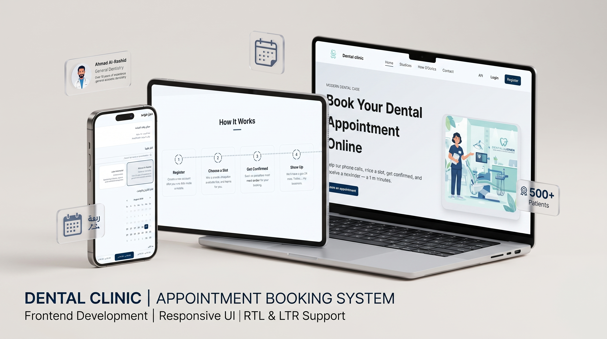

# Dental Clinic Queue & Appointment Management System

A real-time dental clinic management system designed to handle patient appointment bookings and queue management efficiently.



## Core Features

- **Queue & Appointment Booking**: Handled reliably via **Redis** and **BullMQ** for background job processing and scheduling.
- **Real-Time Live Updates**: Driven by **WebSockets** to sync queue statuses and bookings instantly across dashboard interfaces.
- **Authentication & Authorization**: Secure access control using **JWTs** and **Refresh Tokens** with Role-Based Access Control (RBAC) (e.g., Admins, Doctors, Receptionists, Patients).

### Backend Features (NestJS)

- **Authentication & Security**: Multi-role security rules, JWT generation, and refresh token rotation.
- **Appointment Scheduler**: Scheduling engine supporting bookings, status transitions, and doctor assignments.
- **Queue & Waitlist Management**: Live waiting queue system integrated with BullMQ.
- **Waitlist Offer Engine**: An automated matching engine that detects open slots and broadcasts/offers them to waitlisted patients.
- **Real-Time Live Gateway**: WebSocket gateway providing live-updates for appointment and queue actions.
- **Notifications**: Automated transactional notifications and emails managed through a central notification queue.
- **Analytics & Audits**: Basic performance dashboards, clinic metrics, and changes logged through a central audit system.

### Dashboard Features (React & Vite)

- **Role-Based Portals**:
  - **Admin**: User & doctor management, clinic settings, and system audit logs.
  - **Receptionist**: Patient check-ins, queue management, walk-ins, and booking.
  - **Doctor**: Personalized schedule, live patient queue status, and daily agenda.
  - **Patient**: Real-time appointment booking, waitlist status, and offer acceptance.
- **Public Lobby Display**: Live queue monitor screen for waiting areas.
- **State & Route Management**: Handled via TanStack Router and TanStack Query for optimal performance and caching.

---

## Project Structure

- **`/backend`**: NestJS application utilizing Prisma ORM, Postgres, Redis, WebSockets, and BullMQ.
- **`/dashboard`**: React application powered by Vite, Tailwind CSS, and TanStack query/router for the management interface.
- **`docker-compose.yml`**: Docker configuration to spin up local database (Postgres), cache (Redis), and email testing tool (Mailhog).

---

## Quick Start

### 1. Prerequisites

Ensure you have the following installed:
- [Node.js](https://nodejs.org/) (v18+ recommended)
- [pnpm](https://pnpm.io/) (used for package management)
- [Docker & Docker Compose](https://www.docker.com/)

---

### 2. Start Services (Docker)

Spin up Postgres, Redis, and Mailhog containers:

```bash
docker compose up -d
```

---

### 3. Setup and Run Backend

1. Navigate to the backend directory:
   ```bash
   cd backend
   ```
2. Copy environmental variables and configure them:
   ```bash
   cp .env.example .env
   ```
3. Install dependencies and apply migrations:
   ```bash
   pnpm install
   npx prisma migrate dev
   ```
4. Start the development server:
   ```bash
   pnpm run start:dev
   ```

---

### 4. Setup and Run Dashboard

1. Navigate to the dashboard directory:
   ```bash
   cd ../dashboard
   ```
2. Copy environmental variables:
   ```bash
   cp .env.example .env
   ```
3. Install dependencies:
   ```bash
   pnpm install
   ```
4. Start the frontend development server:
   ```bash
   pnpm run dev
   ```
